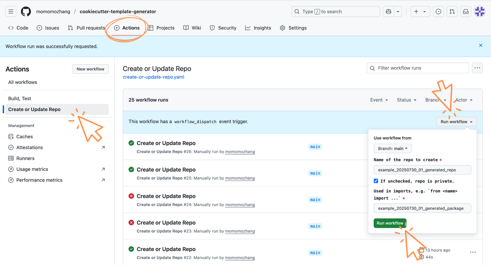

<div align="center">
  <h1 align="center">Python Repo &amp; PyPI Package Starter</h1>
</div>

<div align="center">
  
</div>

<div align="center">

[](https://github.com/momomozhang/cookiecutter-template-generator)
[](https://www.python.org/downloads/)
[](https://github.com/cookiecutter/cookiecutter)
[](LICENSE)

</div>


Generator tool to bootstrap a new Python project, all done through a GitHub Action.
It's the final project from [Taking Python to Production Course](https://www.udemy.com/course/setting-up-the-linux-terminal-for-software-development/) by @phitoduck


## 👉 [Check a generated repo here](https://github.com/momomozhang/sample_generated_repo_20250731) 👈

## 🎉 What I learned:
- CI/CD principles and Github Actions
- Pytest testing and coverage
- Bash scripting and shell automation
- Pre-commit hooks and automated code quality
- Pyproject.toml configuration
- Setuptools and PyPI publishing workflows
- Repository automation
- Cookiecutter templating


## Each newly generated repo comes with:
- A modern `pyproject.toml` setup.
- `pytest` for testing.
- `ruff` and `pylint` for code quality.
- A basic CI workflow that runs tests.
- **Automatic PyPI publishing** - users can `pip install` my package once published.
- Automatically includes non-Python files (JSON, YAML, etc.) in the PyPI distributions with proper `pyproject.toml` configuration


## Using This Template Generator

### Creating a New Repository

1. **Fork this repository** to your GitHub account
2. **Add below secrets in *this* template repo:**
   - `PERSONAL_GITHUB_TOKEN` - for creating and configuring repos
   - `TEST_PYPI_TOKEN` - for publishing to test PyPI
   - `PROD_PYPI_TOKEN` - for publishing to production PyPI
3. **Run the GitHub workflow:**
    - Go to **Actions** tab
    - Select **"Create or Update Repo"** workflow
    - Fill in:
    - Repository name
    - Public/private visibility
    - Package import name (for `import package_name`)
    - Click **"Run workflow"**.
    - **Go to the newly generated repo** to review and `merge` the auto-generated pull request to populate the main branch
4. **Clone the newly generated repo to local machine**:
    ```bash
    git clone https://github.com/your-username/your-repo-name.git
    cd your-repo-name
    make install  # Set up development environment

## Contributing

If you have a suggestion or a fix, please feel free to open an issue or a pull request.

### Development Setup
   1. Fork and clone this repository
   2. Install dependencies: `make install`
   3. Verify setup: `make test`
